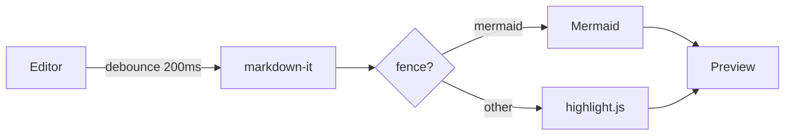

# Markdown Editor Test Document

A quick tour of everything the preview should handle. Open this with `?sample` in the URL while developing.

## Text formatting

Plain paragraph with **bold**, *italic*, ***both***, `inline code`, ~~strike~~ (raw), and a [link to the headings section](#headings-and-anchors). Typographer turns "quotes" and -- dashes -- into their nicer forms... Autolinks work too: https://tauri.app

> A blockquote with **bold** text and a footnote reference.[^1]
>
> Second paragraph inside the quote.

[^1]: This is the footnote body. It renders at the end of the document.

## Lists

1. First item
2. Second item
   1. Nested ordered
   2. Another nested
3. Third item

- Bullet
- Bullet with `code`
  - Nested bullet
    - Deeper

- [ ] An open task
- [x] A completed task
- [ ] Task with **bold** text

Term one
: Definition of term one.

Term two
: Definition of term two, which is a bit longer and wraps across lines when the pane is narrow.

## Table

| Language   | Label     | Highlighted |
|------------|-----------|-------------|
| Rust       | Rust      | yes         |
| TOML       | TOML      | yes         |
| PowerShell | ps1       | no (not in common set) |

## Code

```rust
/// A tiny Rust sample.
#[derive(Debug, Clone)]
pub struct Point { x: f64, y: f64 }

impl Point {
    pub fn norm(&self) -> f64 {
        (self.x * self.x + self.y * self.y).sqrt()
    }
}

fn main() {
    let p = Point { x: 3.0, y: 4.0 };
    println!("{} -> {:?}", p.norm(), p); // 5
}
```

```js
const md = new MarkdownIt({ html: true, linkify: true, typographer: true });
export function render(src) {
  return md.render(src); // returns HTML
}
```

```toml
[package]
name = "markdown-editor"
version = "0.1.0"
```

```
no language: plain block, no label
```

## Math

Inline math like $e^{i\pi} + 1 = 0$ and $\mathbb{N} \subset \mathbb{Z}$, plus a display block:

$$
\Gamma \vdash \varphi \quad\Longleftrightarrow\quad \Gamma \models \varphi
$$

$$
\begin{aligned}
f(x) &= \int_0^x g(t)\,dt \\
     &= \begin{cases} 1 & x \ge 0 \\ 0 & \text{otherwise} \end{cases}
\end{aligned}
$$

## Diagram



## Headings and anchors

### Level three

#### Level four

##### Level five

###### Level six

## Details

<details>
<summary>Click to expand (forced open when exporting)</summary>

Hidden content with a list:

- one
- two

</details>

## Keyboard

Press <kbd>Ctrl</kbd> + <kbd>B</kbd> for bold and <kbd>Ctrl</kbd> + <kbd>I</kbd> for italic.

---

The end.
