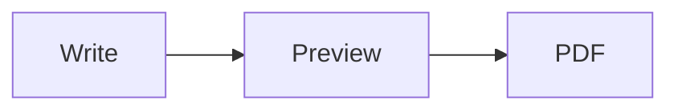

# Welcome to Impression

A lightweight markdown editor. What you see on the right is a print preview: **Export to PDF** produces exactly this.

This document is a normal tab. Close it when you're done, or use it as a scratchpad; nothing here is saved unless you choose **Save As**. Reopen it any time from **Help > Welcome**.

## Keyboard shortcuts

| Keys | Action |
|------|--------|
| Ctrl+N / Ctrl+O | New file / Open |
| Ctrl+S / Ctrl+Shift+S | Save / Save As |
| Ctrl+P | Export to PDF |
| Ctrl+W | Close tab |
| Ctrl+Tab / Ctrl+Shift+Tab | Next / previous tab |
| Ctrl+B / Ctrl+I | Bold / italic (wraps the selection, or toggles at the cursor) |
| Ctrl+F | Find in the editor |
| Ctrl+Shift+P | Show / hide the preview |
| Ctrl+Shift+W | Writing mode: inline rendering, preview collapsed |
| Ctrl+Shift+O | Show / hide the outline |
| Ctrl+Shift+C | Clean view: no gutter or status bar |
| Ctrl+Shift+E | Edit the preview stylesheet |
| Ctrl+Shift+H | This welcome page |
| Ctrl+Shift+. / Ctrl+Shift+, | Editor font size up / down (or Ctrl+wheel over the editor) |
| Ctrl+Shift+] / Ctrl+Shift+[ | Preview zoom in / out (or Ctrl+wheel over the preview) |
| Right-click in the preview | Copy, Select All, Jump to Source |

## Markdown cheatsheet

### Headings and text

```markdown
# Heading 1
## Heading 2
### Heading 3

**bold**, *italic*, ***both***, ~~strikethrough~~, `inline code`
```

Typographer is on: "quotes", -- dashes, and ... become "quotes", -- dashes, and ...

### Lists

```markdown
- Bullet
  - Nested bullet
1. Numbered
2. Numbered

- [ ] Task to do
- [x] Task done
```

- [ ] Task to do
- [x] Task done

### Links and images

```markdown
[Link text](https://example.com)
[Jump to a heading](#markdown-cheatsheet)

https://autolinks.work.too
```

Heading links survive into the PDF as clickable jumps: [back to the shortcuts](#keyboard-shortcuts).

### Code

````markdown
```python
def greet(name):
    return f"Hello, {name}!"
```
````

```python
def greet(name):
    return f"Hello, {name}!"
```

### Tables

```markdown
| Column | Aligned |
|--------|---------|
| cell   | cell    |
```

| Column | Aligned |
|--------|---------|
| cell   | cell    |

### Quotes, rules and details

```markdown
> A blockquote.
> Continued.

---

<details>
<summary>Collapsed section</summary>

Hidden until opened. Forced open when exporting to PDF.

</details>
```

> A blockquote.
> Continued.

---

<details>
<summary>Collapsed section</summary>

Hidden until opened. Forced open when exporting to PDF.

</details>

### Footnotes and definitions

```markdown
A claim with a footnote.[^1]

[^1]: The footnote text, shown at the end of the document.

Term
: Definition of the term.
```

A claim with a footnote.[^1]

[^1]: The footnote text, shown at the end of the document.

Term
: Definition of the term.

### Math (KaTeX)

```markdown
Inline $e^{i\pi} + 1 = 0$ and a display block:

$$
\int_0^1 x^2 \, dx = \frac{1}{3}
$$
```

Inline $e^{i\pi} + 1 = 0$ and a display block:

$$
\int_0^1 x^2 \, dx = \frac{1}{3}
$$

### Diagrams (Mermaid)

````markdown

````


## Styling the preview

**View > Preview Style > Edit Preview Styles** (Ctrl+Shift+E) opens `user_styles.css`, a copy of the built-in stylesheet, in a tab. Edits apply live and also shape the PDF. Drop any other `.css` file into the styles folder (**Open Styles Folder**) to switch between designs.
